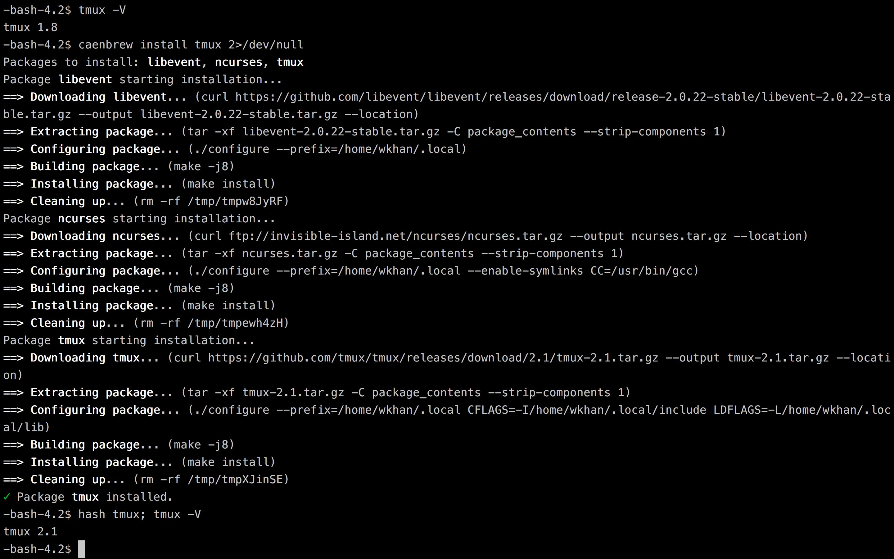

# Caenbrew [](https://travis-ci.org/arxanas/caenbrew) [](https://pypi.python.org/pypi/caenbrew)

Caenbrew is a package manager for the [Computer-Aided Engineering Network (CAEN)
at the University of Michigan][caen]. The packages on CAEN are often outdated,
and many common ones are missing entirely. Getting packages to compile on CAEN
can require lots of workarounds due to the library versions (and sometimes due
to the networked nature of the filesystem!).

  [caen]: http://caen.engin.umich.edu/

The package definitions take CAEN-specific build quirks into account. For
example, the `ncurses` library has two separate bugs which may manifest when
trying to compile it on CAEN. This is all handled for you by the package author.

Caenbrew currently supports more than 20 popular packages. One sorely-missed
package is `tmux`, which has historically been unavailable or outdated on CAEN,
and it's very difficult to compile its dependencies. But installing it with
Caenbrew is a breeze:



# Installation

Run this in your terminal on CAEN:

```
curl -fsSL https://raw.githubusercontent.com/arxanas/caenbrew/master/install.sh | sh
```

Then restart your terminal and brew away!

# Usage

Commands:

  * `caenbrew list`: List all packages.
  * `caenbrew list -s '<term>'`: List all packages matching a search term.
  * `caenbrew install <package>`: Install a package.
  * `caenbrew install -f <package>`: Force-install or reinstall a package. (Use
    `caenbrew install -f caenbrew` if you want to update Caenbrew.)
  * `caenbrew uninstall <package>`: Uninstall a package.

Caenbrew will automatically resolve and install dependencies for you. For
example, the `tmux` package will automatically install `libevent` and `ncurses`.
